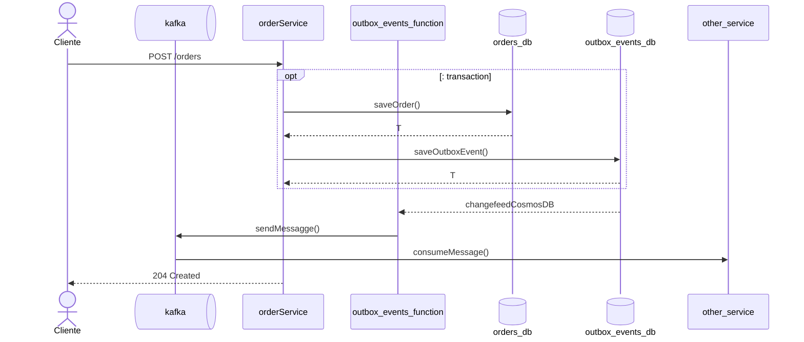

# Outbox Transaction Pattern Sequence Diagram

### CosmosDB
Docker image: https://learn.microsoft.com/en-us/azure/cosmos-db/how-to-develop-emulator?tabs=docker-windows%2Ccsharp&pivots=api-nosql#import-the-emulators-tlsssl-certificate

Azure Function with spring framework:
https://learn.microsoft.com/en-us/azure/developer/java/spring-framework/getting-started-with-spring-cloud-function-in-azure?toc=/azure/azure-functions/toc.json&bc=/azure/azure-functions/breadcrumb/toc.json